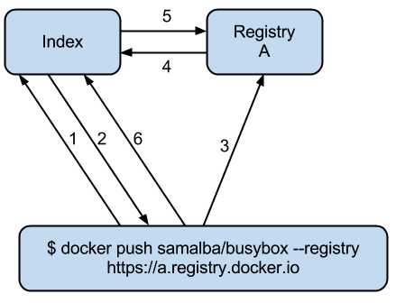
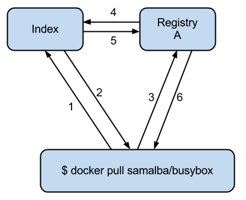

## Docker Registry V1 Protocol

Offical Docker Registry V1 Doc is [here](https://docs.docker.com/v1.7/docker/reference/api/hub_registry_spec).

### Docker Registry V1 Types: 

- sponsor registry: such a registry is provided by a third-party hosting infrastructure as a convenience for their customers and the Docker community as a whole. Its costs are supported by the third party, but the management and operation of the registry are supported by Docker, Inc. It features read/write access, and delegates authentication and authorization to the Docker Hub.
- mirror registry: such a registry is provided by a third-party hosting infrastructure but is targeted at their customers only. Some mechanism (unspecified to date) ensures that public images are pulled from a sponsor registry to the mirror registry, to make sure that the customers of the third-party provider can docker pull those images locally.
- vendor registry: such a registry is provided by a software vendor who wants to distribute docker images. It would be operated and managed by the vendor. Only users authorized by the vendor would be able to get write access. Some images would be public (accessible for anyone), others private (accessible only for authorized users). Authentication and authorization would be delegated to the Docker Hub. The goal of vendor registries is to let someone do docker pull basho/riak1.3 and automatically push from the vendor registry (instead of a sponsor registry); i.e., vendors get all the convenience of a sponsor registry, while retaining control on the asset distribution.
- private registry: such a registry is located behind a firewall, or protected by an additional security layer (HTTP authorization, SSL client-side certificates, IP address authorization…). The registry is operated by a private entity, outside of Docker’s control. It can optionally delegate additional authorization to the Docker Hub, but it is not mandatory.

### Docker Registry V1 Push 



1. Contact the Docker Registry to allocate the repository name “samalba/busybox” (authentication required with user credentials). If authentication works and namespace available, “samalba/busybox” is allocated and a temporary token is returned.
  - (Docker Client -> Docker Registry) `PUT /v1/repositories/:namespace/:repository`
  - Request Headers:

    ```
      Authorization: Basic sdkjfskdjfhsdkjfh== 
      X-Docker-Token: true
    ```

  - Request Body:

    ```
      [{“id”: “9e89cc6f0bc3c38722009fe6857087b486531f9a779a0c17e3ed29dae8f12c4f”}]
    ```

  - Response HTTP Code:

    ```
      200
    ```

  - Response Header:

    ```
      WWW-Authenticate: Token signature=123abc,repository=”samalba/busybox”,access=write
      X-Docker-Endpoints: registry.docker.io [, registry2.docker.io]
    ```

  - Response Body:

    ```
   	  {}
    ```
2. Push the image on the registry along with the token.

  - 2.1 (Docker Client -> Docker Registry) `GET /v1/images/:image/json`
  - 2.2 (Docker Client -> Docker Registry) `PUT /v1/images/:image/json`
  - 2.3 (Docker Client -> Docker Registry) `PUT /v1/images/:image/layer`
  - 2.4 (Docker Client -> Docker Registry) `PUT /v1/images/:image/checksum` 
  - 2.5 (Docker Client -> Docker Registry) `PUT /v1/:namespace/:repository/tags/:tag`

### Docker Registry V1 Pull

